# Foxel Plus 🦊

[](https://github.com/maxage/foxel-plus/actions/workflows/ci.yml)
[](https://github.com/maxage/foxel-plus/actions/workflows/auto-release.yml)
[](https://opensource.org/licenses/MIT)
[](https://www.typescriptlang.org/)
[](https://react.dev/)

> 🚀 为 [Foxel](https://foxel.cc) 私有云存储系统开发的多插件仓库，提供丰富的文件查看和处理功能。基于 TypeScript + React + ESBuild 构建，完全自包含，即插即用。

## ✨ 特性

- 🎯 **即插即用** - 下载即用，无需复杂配置
- 🔧 **完全自包含** - 单文件输出，无外部依赖
- 🎨 **现代化 UI** - 基于 React 18 + TypeScript 构建
- 📱 **响应式设计** - 适配各种屏幕尺寸
- 🌙 **深色主题** - 护眼的深色界面设计
- ⚡ **高性能** - 基于 ESBuild 快速构建
- 🔒 **类型安全** - 完整的 TypeScript 类型支持
- 🛠️ **易于开发** - 完整的开发工具链和文档

## 🚀 快速开始

### 📥 安装插件

#### 方法一：直接下载（推荐）

1. 访问 [Releases 页面](https://github.com/maxage/foxel-plus/releases/latest)
2. 下载所需的插件文件：
   - 图片查看器：`foxel-image-viewer-plus.js`
   - 代码查看器：`foxel-code-viewer-plus.js`
3. 在 Foxel 的"应用"页面添加插件
4. 输入对应的插件 URL：
   - 图片查看器：`https://github.com/maxage/foxel-plus/releases/latest/download/foxel-image-viewer-plus.js`
   - 代码查看器：`https://github.com/maxage/foxel-plus/releases/latest/download/foxel-code-viewer-plus.js`
5. 安装完成后即可在文件管理器中查看对应文件类型

### 📦 可用插件

| 插件名称 | 描述 | 作者 | 下载链接 |
|---------|------|------|----------|
| **foxel-image-viewer-plus** | 功能强大的图片查看器 Plus，支持缩放、拖拽、旋转、翻转、全屏、键盘快捷键等丰富功能 | Foxel Plus Team @ maxage | [下载](https://github.com/maxage/foxel-plus/releases/latest/download/foxel-image-viewer-plus.js) |
| **foxel-code-viewer-plus** | 功能强大的代码查看器 Plus，支持语法高亮、主题切换、搜索、折叠、复制等丰富功能 | Foxel Plus Team @ maxage | [下载](https://github.com/maxage/foxel-plus/releases/latest/download/foxel-code-viewer-plus.js) |

#### 方法二：从源码构建

```bash
# 克隆仓库
git clone https://github.com/maxage/foxel-plus.git
cd foxel-plus

# 构建图片查看器插件
cd foxel-image-viewer
npm install
npm run build
# 构建完成后，dist/plugin.js 就是可用的插件文件

# 构建代码查看器插件
cd ../foxel-code-viewer
npm install
npm run build
# 构建完成后，dist/plugin.js 就是可用的插件文件
```

### 🛠️ 开发环境设置

#### 前置要求

- Node.js 18+ 
- npm 或 yarn
- Git

#### 本地开发

```bash
# 1. 克隆仓库
git clone https://github.com/maxage/foxel-plus.git
cd foxel-plus

# 2. 安装所有插件依赖
for plugin in foxel-*/; do
  if [ -f "$plugin/package.json" ]; then
    echo "Installing dependencies for $plugin..."
    cd "$plugin"
    npm install
    cd ..
  fi
done

# 3. 开发模式（监听文件变化）
cd foxel-image-viewer
npm run dev

# 4. 生产构建
npm run build
```

## 📦 可用插件

### 🖼️ 图片查看器 (foxel-image-viewer)

一个功能丰富的图片查看器插件，支持多种图片格式和操作。

| 属性 | 值 |
|------|-----|
| **版本** | v1.0.0 |
| **文件大小** | ~145KB |
| **支持格式** | JPG, PNG, GIF, BMP, WebP, SVG, ICO, TIFF |
| **技术栈** | React 18 + TypeScript + ESBuild |

#### ✨ 主要功能

- 🔍 **智能缩放** - 鼠标滚轮缩放（10%-500%）
- 🖱️ **拖拽移动** - 流畅的图片拖拽体验
- 🎛️ **工具栏控制** - 缩放、重置、适应屏幕、关闭
- 🌙 **深色主题** - 护眼的现代化界面
- 📱 **响应式设计** - 适配各种屏幕尺寸
- ⚡ **高性能** - 优化的渲染和交互体验
- 🎨 **美观界面** - 简洁现代的 UI 设计

#### 📥 安装方式

```bash
# 方式一：直接下载
wget https://github.com/maxage/foxel-plus/raw/main/foxel-image-viewer.js

# 方式二：从源码构建
git clone https://github.com/maxage/foxel-plus.git
cd foxel-plus/foxel-image-viewer
npm install && npm run build
```

#### 🎮 使用说明

1. 在 Foxel 文件管理器中找到图片文件
2. 右键点击图片文件
3. 选择"图片查看器"应用
4. 享受图片查看体验！

#### 🎯 操作指南

| 操作 | 说明 |
|------|------|
| **鼠标滚轮** | 缩放图片 |
| **左键拖拽** | 移动图片位置 |
| **工具栏按钮** | 各种快捷操作 |
| **键盘快捷键** | 支持常用快捷键 |

---

### 🔮 即将推出

- 📹 **视频播放器** - 支持多种视频格式
- 📄 **文档查看器** - PDF、Word、Excel 等
- 🎵 **音频播放器** - 音乐播放和管理
- 📦 **压缩包查看器** - ZIP、RAR 等压缩文件
- 💻 **代码查看器** - 语法高亮的代码查看

## 🛠️ 开发指南

### 🚀 快速创建新插件

#### 1. 使用模板创建

```bash
# 克隆仓库
git clone https://github.com/maxage/foxel-plus.git
cd foxel-plus

# 复制模板
cp -r foxel-image-viewer foxel-your-plugin-name
cd foxel-your-plugin-name

# 修改插件信息
# 编辑 package.json 中的 name, description 等字段
# 编辑 src/index.tsx 中的插件配置
```

#### 2. 插件目录结构

```
foxel-your-plugin/
├── src/
│   ├── App.tsx          # React 主组件
│   └── index.tsx        # 插件入口文件
├── dist/
│   └── plugin.js        # 构建输出文件
├── package.json         # 项目配置文件
├── tsconfig.json        # TypeScript 配置
├── foxel.d.ts          # Foxel 类型定义
├── build.sh            # 构建脚本
└── README.md           # 插件文档
```

#### 3. 开发工作流

```bash
# 安装依赖
npm install

# 开发模式（监听文件变化）
npm run dev

# 生产构建
npm run build

# 清理构建文件
npm run clean

# 使用构建脚本
./build.sh
```

### 📋 插件开发规范

#### 必需实现

- [ ] `window.FoxelRegister(plugin)` 注册插件
- [ ] `mount(container, ctx)` 挂载方法
- [ ] `unmount(container)` 卸载方法（可选）
- [ ] 使用 `ctx.urls.downloadUrl` 读取文件
- [ ] 仅操作传入的 `container` 节点
- [ ] 样式使用唯一 ID 避免污染

#### 推荐配置

- [ ] 设置合适的 `supportedExts`
- [ ] 提供清晰的 `name` 和 `description`
- [ ] 添加 `icon`（建议使用 data URI）
- [ ] 设置合理的 `defaultBounds`
- [ ] 输出 IIFE 格式单文件

#### 代码规范

```typescript
// 插件基本结构
const plugin: RegisteredPlugin = {
  key: 'com.your-org.plugin-name',
  name: '插件名称',
  version: '1.0.0',
  description: '插件描述',
  author: 'Your Name',
  supportedExts: ['jpg', 'png', 'gif'],
  defaultBounds: { width: 800, height: 600 },
  icon: 'data:image/svg+xml;base64,...',
  
  mount: (container: HTMLElement, ctx: PluginMountCtx) => {
    // 插件挂载逻辑
  },
  
  unmount: (container: HTMLElement) => {
    // 插件卸载逻辑
  }
};
```

### 🔧 技术栈详解

| 技术 | 版本 | 用途 |
|------|------|------|
| **React** | 18.3+ | UI 框架 |
| **TypeScript** | 5.5+ | 类型安全 |
| **ESBuild** | 0.25+ | 构建工具 |
| **Foxel API** | Latest | 插件接口 |

### 📚 开发资源

- [Foxel 插件开发指南](https://foxel.cc/guide/plugins-guide.html)
- [React 官方文档](https://react.dev)
- [TypeScript 手册](https://www.typescriptlang.org/docs/)
- [ESBuild 文档](https://esbuild.github.io/)

## 🤝 贡献指南

### 🐛 报告问题

我们欢迎各种形式的贡献！请使用以下模板：

- 🐛 **Bug 报告**: [Bug Report 模板](.github/ISSUE_TEMPLATE/bug_report.md)
- ✨ **功能请求**: [Feature Request 模板](.github/ISSUE_TEMPLATE/feature_request.md)
- 🔌 **插件请求**: [Plugin Request 模板](.github/ISSUE_TEMPLATE/plugin_request.md)

### 🚀 提交代码

#### 1. Fork 和克隆

```bash
# Fork 仓库后克隆
git clone https://github.com/your-username/foxel-plus.git
cd foxel-plus

# 添加上游仓库
git remote add upstream https://github.com/maxage/foxel-plus.git
```

#### 2. 创建功能分支

```bash
# 创建并切换到新分支
git checkout -b feature/amazing-feature

# 或者修复 Bug
git checkout -b fix/bug-description
```

#### 3. 开发和提交

```bash
# 开发你的功能
# ...

# 添加更改
git add .

# 提交更改（使用规范的提交信息）
git commit -m "feat: add amazing feature"
# 或者
git commit -m "fix: resolve bug in image viewer"
```

#### 4. 推送和创建 PR

```bash
# 推送分支
git push origin feature/amazing-feature

# 在 GitHub 上创建 Pull Request
```

### 📝 提交信息规范

我们使用 [Conventional Commits](https://www.conventionalcommits.org/) 规范：

| 类型 | 说明 | 示例 |
|------|------|------|
| `feat` | 新功能 | `feat: add video player plugin` |
| `fix` | Bug 修复 | `fix: resolve image scaling issue` |
| `docs` | 文档更新 | `docs: update installation guide` |
| `style` | 代码格式 | `style: format code with prettier` |
| `refactor` | 代码重构 | `refactor: optimize build process` |
| `test` | 测试相关 | `test: add unit tests for image viewer` |
| `chore` | 构建/工具 | `chore: update dependencies` |

### 🔍 代码审查

- 确保所有检查通过
- 响应审查意见
- 保持 PR 简洁，一次只做一件事
- 添加必要的测试和文档

## 🏗️ 项目架构

### 📁 目录结构

```
foxel-plus/
├── .github/                 # GitHub 配置
│   ├── workflows/          # GitHub Actions
│   ├── ISSUE_TEMPLATE/     # Issue 模板
│   └── ...
├── foxel-image-viewer/     # 图片查看器插件
├── foxel-video-player/     # 视频播放器插件（计划中）
├── .gitignore              # Git 忽略文件
├── .gitattributes          # Git 属性配置
├── README.md               # 项目说明
├── CONTRIBUTING.md         # 贡献指南
├── CHANGELOG.md            # 更新日志
└── LICENSE                 # 许可证
```

### 🔄 工作流

```mermaid
graph LR
    A[开发] --> B[测试]
    B --> C[提交]
    C --> D[CI/CD]
    D --> E[构建]
    E --> F[发布]
    F --> G[部署]
```



### 🛠️ 技术选型

| 层级 | 技术 | 选择理由 |
|------|------|----------|
| **UI 框架** | React 18 | 成熟稳定，生态丰富 |
| **类型系统** | TypeScript | 类型安全，开发体验好 |
| **构建工具** | ESBuild | 构建速度快，输出小 |
| **包管理** | npm | 标准包管理器 |
| **版本控制** | Git | 分布式版本控制 |
| **CI/CD** | GitHub Actions | 与 GitHub 深度集成 |

## 📚 相关资源

### 🔗 官方链接

- [Foxel 官网](https://foxel.cc) - 官方主页
- [Foxel GitHub](https://github.com/DrizzleTime/Foxel) - 官方仓库
- [插件开发指南](https://foxel.cc/guide/plugins-guide.html) - 详细开发文档

### 🛠️ 技术文档

- [React 官方文档](https://react.dev) - React 框架文档
- [TypeScript 手册](https://www.typescriptlang.org/docs/) - TypeScript 类型系统
- [ESBuild 文档](https://esbuild.github.io/) - 构建工具文档
- [Conventional Commits](https://www.conventionalcommits.org/) - 提交信息规范

### 🎯 学习资源

- [Foxel 插件示例](https://github.com/DrizzleTime/foxel-text-viewer) - 官方文本查看器示例
- [React 最佳实践](https://react.dev/learn) - React 学习指南
- [TypeScript 入门](https://www.typescriptlang.org/docs/handbook/intro.html) - TypeScript 入门教程

## 🔄 自动发布

本项目使用 GitHub Actions 实现自动构建和发布：

### 🚀 自动触发条件

- **插件文件修改** - 当任何 `foxel-*/` 目录下的文件发生变更时
- **根目录插件文件修改** - 当任何 `foxel-*.js` 文件发生变更时
- **推送到 main 分支** - 确保只在主分支上触发

### 📦 发布流程

1. **自动检测** - 检测到插件文件变更，识别所有修改的插件
2. **构建插件** - 使用 ESBuild 构建所有修改的插件
3. **版本管理** - 从第一个修改插件的 `package.json` 读取版本号
4. **创建标签** - 自动创建 Git 标签
5. **发布 Release** - 在 GitHub 上创建 Release，包含所有插件文件
6. **更新文件** - 更新根目录对应的插件文件

### 🛠️ 手动操作

- **手动发布** - 使用 "Manual Release" 工作流
- **测试发布** - 使用 "Test Release" 工作流创建预发布版本
- **版本控制** - 通过修改 `package.json` 中的版本号来管理版本

### 📋 工作流说明

| 工作流 | 触发条件 | 用途 |
|--------|----------|------|
| **Auto Release** | 插件文件变更 | 自动构建和发布正式版本 |
| **Manual Release** | 手动触发 | 手动创建指定版本的发布 |
| **Test Release** | 手动触发 | 创建测试版本用于验证 |
| **CI** | 代码推送 | 代码质量检查和测试 |

## 📊 项目统计


## 📄 许可证

本项目采用 [MIT 许可证](LICENSE)。

```
MIT License

Copyright (c) 2024 Foxel Plus

Permission is hereby granted, free of charge, to any person obtaining a copy
of this software and associated documentation files (the "Software"), to deal
in the Software without restriction, including without limitation the rights
to use, copy, modify, merge, publish, distribute, sublicense, and/or sell
copies of the Software, and to permit persons to whom the Software is
furnished to do so, subject to the following conditions:

The above copyright notice and this permission notice shall be included in all
copies or substantial portions of the Software.

THE SOFTWARE IS PROVIDED "AS IS", WITHOUT WARRANTY OF ANY KIND, EXPRESS OR
IMPLIED, INCLUDING BUT NOT LIMITED TO THE WARRANTIES OF MERCHANTABILITY,
FITNESS FOR A PARTICULAR PURPOSE AND NONINFRINGEMENT. IN NO EVENT SHALL THE
AUTHORS OR COPYRIGHT HOLDERS BE LIABLE FOR ANY CLAIM, DAMAGES OR OTHER
LIABILITY, WHETHER IN AN ACTION OF CONTRACT, TORT OR OTHERWISE, ARISING FROM,
OUT OF OR IN CONNECTION WITH THE SOFTWARE OR THE USE OR OTHER DEALINGS IN THE
SOFTWARE.
```

## 🙏 致谢

感谢以下项目和社区的支持：

- [Foxel](https://foxel.cc) - 提供优秀的插件系统架构
- [React](https://react.dev) - 强大的 UI 框架
- [TypeScript](https://www.typescriptlang.org) - 类型安全的 JavaScript
- [ESBuild](https://esbuild.github.io) - 极速的构建工具
- [GitHub](https://github.com) - 代码托管和 CI/CD 平台

## 🎉 支持我们

如果这个项目对你有帮助，请考虑：

- ⭐ **给个 Star** - 让更多人看到这个项目
- 🍴 **Fork 项目** - 参与开发和改进
- 🐛 **报告问题** - 帮助我们改进
- 💡 **提出建议** - 分享你的想法
- 📢 **分享给朋友** - 让更多人受益

---

<div align="center">

**🚀 让 Foxel 更强大，让文件管理更简单！**

[](https://github.com/maxage/foxel-plus)
[](https://github.com/maxage/foxel-plus/fork)
[](https://github.com/maxage/foxel-plus/issues)

</div>
