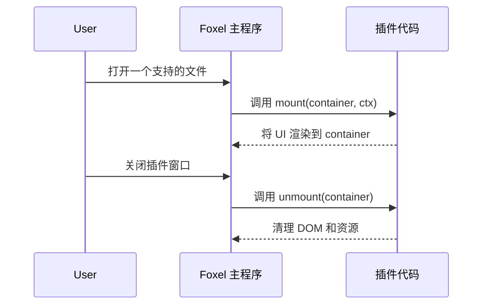
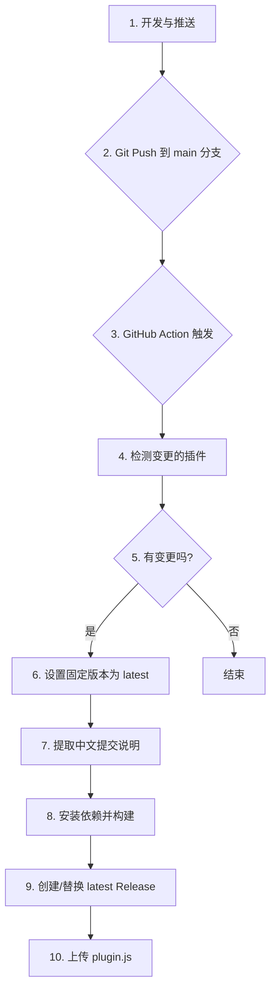

# Foxel Plus 插件开发规范

## 1. 概述

本文档为 `foxel-plus` 项目的插件开发提供了一套统一的规范和最佳实践。所有插件开发者（包括 AI 助手）都应遵循此规范，以确保插件的质量、一致性和可维护性。

本项目基于 [Foxel](https://github.com/DrizzleTime/Foxel) 官方插件开发指南，实现了完全自动化的构建、版本管理和发布流程。

## 2. Git 提交信息规范

为了实现发布说明的自动化生成，所有 Git 提交都必须遵循以下"约定式提交"格式。**提交信息必须使用中文**。

### 格式

```
<类型>(<范围>): <主题>

[正文]

[脚注]
```

*   **类型 (Type)**: 必须是以下之一：
    *   `feat`: 新功能
    *   `fix`: Bug 修复
    *   `docs`: 文档变更
    *   `style`: 代码风格（不影响代码运行的变动）
    *   `refactor`: 重构（既不是新增功能，也不是修改 bug 的代码变动）
    *   `perf`: 性能优化
    *   `test`: 增加测试
    *   `chore`: 构建过程或辅助工具的变动

*   **范围 (Scope)**: **必须**是本次提交影响的插件目录名。例如 `foxel-code-viewer`。

*   **主题 (Subject)**: 简明扼要地描述本次提交的目的。

### 示例

```
feat(foxel-code-viewer): 增加 Markdown 预览功能

在代码编辑器中为 Markdown 文件增加了实时预览模式。

- 支持标题、列表、代码块等基本语法
- 优化了渲染性能
```

```
fix(foxel-image-viewer): 修复了查看 SVG 文件时崩溃的问题
```

## 3. 项目结构规范

### 3.1 插件文件夹命名规范

**所有插件文件夹必须遵循统一的命名格式：`foxel-<插件名>-<功能名>`**

#### 命名规则
- 插件名用于描述内容类型，如 `code`、`image`、`ebook`
- 功能名用于描述能力，如 `viewer`、`editor`、`reader`
- 仅使用小写字母和连字符，保持简洁、语义清晰

#### 示例
```
✅ 正确格式：
foxel-code-viewer
foxel-image-viewer
foxel-ebook-reader

❌ 错误格式：
foxel-code
foxel-image-viewer-plus
foxel-ebookreader
```

#### 重命名影响
- 插件文件夹重命名后，需要更新：
  - CI 工作流中的插件检测逻辑
  - 根目录的 JS 文件名称
  - README.md 中的引用

### 3.2 GitHub Actions 权限规范

**所有需要创建 Release 的工作流都必须配置正确的权限**

#### 必需权限配置
```yaml
permissions:
  contents: write    # 允许创建和修改 release
  pull-requests: read # 允许读取 PR 信息（用于生成发布说明）
```

#### 权限配置位置
- 在需要创建 release 的 job 级别配置
- 不要在工作流级别配置，避免过度授权

#### 示例
```yaml
jobs:
  build-and-release:
    runs-on: ubuntu-latest
    permissions:
      contents: write
      pull-requests: read
    steps:
      # ... 构建和发布步骤
```

#### 常见权限问题
- `Resource not accessible by integration`：缺少 `contents: write` 权限
- 无法读取 PR 信息：缺少 `pull-requests: read` 权限

## 4. 插件生命周期

插件的生命周期由 Foxel 主程序管理，主要包含 `mount` 和 `unmount` 两个阶段。



## 4. 标准项目结构

每个插件都应作为一个独立的子目录存在，并包含以下标准文件结构：

```
foxel-<插件名>-<功能名>/
├── dist/
│   └── plugin.js         # 构建产物 (自动生成, .gitignore 中应忽略)
├── src/
│   ├── App.tsx           # 插件主 UI 组件
│   ├── index.tsx         # 插件入口和注册逻辑
│   ├── components/       # 子组件 (可选)
│   ├── hooks/            # 自定义 Hooks (可选)
│   ├── utils/            # 工具函数 (可选)
│   └── styles/           # 样式文件 (可选)
├── .gitignore
├── foxel.d.ts            # 官方类型定义 (从模板复制, 请勿修改)
├── package.json          # 项目元数据和脚本
├── README.md             # 插件说明文档
├── tsconfig.json         # TypeScript 配置
└── validate-plugin.js    # 插件验证脚本
```

### 4.1 插件命名规范

- **目录名**: `foxel-<插件名>-<功能名>`
- **插件 key**: `com.foxel-plus.<插件名>-<功能名>`
- **显示名称**: `<插件中文名><功能中文名>`（如“代码查看器”、“图书阅读器”）
- **包名**: `foxel-<插件名>-<功能名>`

### 4.2 必需文件说明

- `foxel.d.ts`: 必须从现有插件复制，不得修改
- `package.json`: 使用标准模板，版本号由自动化流程管理
- `tsconfig.json`: 使用标准配置
- `validate-plugin.js`: 使用标准验证脚本

## 5. `package.json` 规范

`package.json` 文件是插件的身份标识，必须包含以下核心字段：

*   `name`: 插件名称，格式为 `foxel-<插件名>-<功能名>` (例如: `foxel-code-viewer`)。
*   `version`: 插件版本号，遵循 [SemVer](https://semver.org/) 规范。**此版本号将由自动化流程管理，请勿手动修改。**
*   `description`: 一句话描述插件的核心功能。
*   `author`: 开发者名称，请统一使用 "Jason"。
*   `main`: 构建产物的入口文件，必须指向 `dist/plugin.js`。

### 标准脚本

为了保持一致性，所有插件都应包含以下 `scripts`：

*   `build`: 生产环境构建，使用 esbuild 打包为 IIFE 格式。
*   `dev`: 开发环境构建，带 watch 功能。
*   `clean`: 清理 `dist` 目录。
*   `validate`: 运行插件验证脚本。

### 标准构建配置

```json
{
  "scripts": {
    "build": "esbuild src/index.tsx --bundle --format=iife --platform=browser --target=es2019 --jsx=automatic --minify --outfile=dist/plugin.js --define:process.env.NODE_ENV='\"production\"' --define:PLUGIN_VERSION='\"'$npm_package_version'\"' --define:PLUGIN_AUTHOR='\"'$npm_package_author'\"'",
    "dev": "esbuild src/index.tsx --bundle --format=iife --platform=browser --target=es2019 --jsx=automatic --outfile=dist/plugin.js --watch",
    "clean": "rm -rf dist",
    "validate": "node validate-plugin.js"
  }
}
```

## 6. 插件定义 (`index.tsx`)

插件的入口文件 (`src/index.tsx`) 负责定义插件对象并调用 `window.FoxelRegister` 进行注册。

### 标准入口文件模板

```typescript
import React from 'react';
import { createRoot } from 'react-dom/client';
import { RegisteredPlugin } from '../foxel.d';
import App from './App';

let root: any = null;

// 从构建时注入的环境变量获取版本信息
declare const PLUGIN_VERSION: string;
declare const PLUGIN_AUTHOR: string;

const plugin: RegisteredPlugin = {
  key: 'com.foxel-plus.<插件名>-<功能名>',
  name: '<插件中文名><功能中文名>',
  version: PLUGIN_VERSION,
  description: '功能描述',
  author: PLUGIN_AUTHOR,
  website: 'https://github.com/maxage/foxel-plus',
  github: 'https://github.com/maxage/foxel-plus',
  supportedExts: ['扩展名1', '扩展名2'],
  defaultBounds: {
    x: 100,
    y: 100,
    width: 800,
    height: 600
  },
  defaultMaximized: false,
  icon: 'https://img.icons8.com/图标路径',

  mount: (container: HTMLElement, ctx) => {
    try {
      // 设置容器 ID 用于样式隔离
      container.id = 'foxel-<插件名>-<功能名>';
      
      // 清理容器
      container.innerHTML = '';

      // 创建 React root
      root = createRoot(container);
      root.render(<App ctx={ctx} />);
    } catch (error) {
      console.error('插件挂载失败:', error);
      container.innerHTML = '<div style="padding: 20px; color: #ff6b6b;">插件加载失败，请刷新页面重试</div>';
    }
  },

  unmount: (container: HTMLElement) => {
    try {
      if (root) {
        root.unmount();
        root = null;
      }
      container.innerHTML = '';
    } catch (error) {
      console.error('插件卸载失败:', error);
    }
  }
};

// 注册插件
if (typeof window !== 'undefined' && window.FoxelRegister) {
  window.FoxelRegister(plugin);
}
```

### `RegisteredPlugin` 接口字段详解

*   `key`: **极其重要**。插件的全局唯一标识符，必须遵循 `com.foxel-plus.<插件名>-<功能名>` 的格式。例如：`com.foxel-plus.code-viewer`。
*   `name`: 显示在插件市场的名称，应清晰易懂。
*   `version`: 必须与 `package.json` 中的版本号保持同步。**自动化流程会确保这一点。**
*   `author`: 必须与 `package.json` 中的作者保持同步。
*   `supportedExts`: 一个字符串数组，定义了此插件可以处理的文件扩展名。
*   `mount`: `(container: HTMLElement, ctx: PluginMountCtx) => void`。插件挂载函数。
*   `unmount`: `(container: HTMLElement) => void`。插件卸载函数。

## 7. UI 和样式

*   **技术栈**: 推荐使用 React + TypeScript。
*   **样式隔离**: 为避免污染 Foxel 全局样式，所有插件的根 DOM 元素都必须有一个**唯一 ID**，格式为 `foxel-<插件名>-<功能名>`。所有 CSS 选择器都应基于这个 ID 进行限定。

### 7.1 主组件模板

```typescript
import React from 'react';
import { PluginMountCtx } from '../foxel.d';

interface AppProps {
  ctx: PluginMountCtx;
}

const App: React.FC<AppProps> = ({ ctx }) => {
  return (
    <div id="foxel-<插件名>-<功能名>">
      {/* 插件内容 */}
    </div>
  );
};

export default App;
```

### 7.2 样式隔离规范

- 所有样式必须基于容器 ID `#foxel-<插件名>-<功能名>` 进行限定
- 使用 CSS Modules 或 styled-components 进行样式隔离
- 避免使用全局样式选择器
- 示例：

```css
/* 正确 - 基于容器 ID 限定 */
#foxel-media-player .player-controls {
  display: flex;
  align-items: center;
}

/* 错误 - 全局样式 */
.player-controls {
  display: flex;
  align-items: center;
}
```

### 7.3 错误处理规范

- 所有异步操作必须包含错误处理
- 用户友好的错误提示
- 避免插件崩溃影响宿主应用
- 在 `mount` 和 `unmount` 中都应该有 try-catch

## 8. 类型定义规范

### 8.1 标准类型定义 (`foxel.d.ts`)

所有插件必须使用统一的类型定义文件，该文件必须从现有插件复制，不得修改：

```typescript
// Foxel Plugin Type Definitions - 符合官方规范
export interface PluginMountCtx {
  filePath: string;
  entry: {
    name: string;
    is_dir: boolean;
    size: number;
    mtime: number;
    type?: string;
    is_image?: boolean;
  };
  urls: {
    downloadUrl: string;
  };
  host: {
    close: () => void;
  };
}

export interface RegisteredPlugin {
  mount: (container: HTMLElement, ctx: PluginMountCtx) => void | Promise<void>;
  unmount?: (container: HTMLElement) => void | Promise<void>;
  key?: string;
  name?: string;
  version?: string;
  supportedExts?: string[];
  defaultBounds?: { x?: number; y?: number; width?: number; height?: number };
  defaultMaximized?: boolean;
  icon?: string;
  description?: string;
  author?: string;
  website?: string;
  github?: string;
}

declare global {
  interface Window {
    FoxelRegister?: (plugin: RegisteredPlugin) => void;
  }
}
```

### 8.2 类型使用规范

- 必须使用 `PluginMountCtx` 接口作为 `mount` 函数的上下文参数
- 必须使用 `RegisteredPlugin` 接口定义插件对象
- 文件读取统一使用 `ctx.urls.downloadUrl`
- 关闭插件使用 `ctx.host.close()`

## 9. AI 开发插件规范

### 9.1 插件创建流程

当使用 AI 开发新插件时，必须遵循以下步骤：

1. **创建插件目录结构**：
   ```
   foxel-<插件名>-<功能名>/
   ├── dist/                    # 构建产物目录 (自动生成)
   ├── src/
   │   ├── App.tsx             # 主组件
   │   ├── index.tsx           # 插件入口
   │   ├── components/         # 子组件 (可选)
   │   ├── hooks/              # 自定义 Hooks (可选)
   │   ├── utils/              # 工具函数 (可选)
   │   └── styles/             # 样式文件 (可选)
   ├── .gitignore
   ├── foxel.d.ts             # 类型定义 (从模板复制)
   ├── package.json           # 项目配置
   ├── README.md              # 插件说明
   ├── tsconfig.json          # TypeScript 配置
   └── validate-plugin.js     # 验证脚本
   ```

2. **必须复制的模板文件**：
   - `foxel.d.ts` - 从现有插件复制，不得修改
   - `package.json` - 使用标准模板
   - `tsconfig.json` - 使用标准配置
   - `validate-plugin.js` - 使用标准验证脚本

### 9.2 AI 开发检查清单

在提交插件代码前，AI 必须确保：

#### 9.2.1 文件结构检查
- [ ] 插件目录名格式正确：`foxel-<插件名>-<功能名>`
- [ ] 包含所有必需文件：`src/index.tsx`, `src/App.tsx`, `package.json`, `foxel.d.ts`, `tsconfig.json`, `validate-plugin.js`
- [ ] `foxel.d.ts` 是从模板复制的，未修改
- [ ] `dist/` 目录在 `.gitignore` 中

#### 9.2.2 代码质量检查
- [ ] 插件 key 格式正确：`com.foxel-plus.<插件名>-<功能名>`
- [ ] 使用环境变量注入版本号和作者信息
- [ ] 正确实现 `mount` 和 `unmount` 生命周期
- [ ] 设置容器 ID 用于样式隔离
- [ ] 包含完整的错误处理
- [ ] 样式基于容器 ID 进行限定

#### 9.2.3 功能检查
- [ ] 支持的文件扩展名合理
- [ ] 默认窗口大小和位置合适
- [ ] 图标 URL 可访问
- [ ] 插件描述清晰准确
- [ ] 使用 `ctx.urls.downloadUrl` 读取文件
- [ ] 使用 `ctx.host.close()` 关闭插件

#### 9.2.4 提交信息检查
- [ ] 提交信息格式正确：`<类型>(<插件名>): <描述>`
- [ ] 使用中文描述
- [ ] 包含详细的功能说明（可选）

## 10. 版本管理与发布流程 (自动化)

本项目的发布流程完全由 **GitHub Actions** 自动化，无需手动编译、打版或发布。

### 10.1 固定版本管理

**所有插件使用固定的 `latest` 版本，每次更新都替换旧版本**

#### 版本管理规则
- 所有插件版本固定为 `latest`
- 每次更新都替换掉旧的 `latest` 版本
- 不进行版本号递增，避免版本管理复杂性
- 每个插件只有一个 tags 和一个 releases

#### 工作流程概述



### 10.2 开发步骤

1.  **本地开发**: 在本地完成插件的功能开发或修复。
2.  **本地验证**: (可选但推荐) 运行 `npm run validate` 和 `npm run build` 确保插件可以正常工作。
3.  **提交代码**: 按照 **Git 提交信息规范** 编写中文提交信息。
4.  **推送代码**: `git push origin main`。
5.  **自动发布**: GitHub Actions 自动检测变更，构建插件，并发布/替换 `latest` 版本。

### 10.3 自动化处理

*   **触发**: 当代码被推送到 `main` 分支时，自动化流程启动。
*   **版本**: 流程会自动检查本次推送中哪些插件目录有文件变动，并自动将其版本设置为 `latest`。
*   **发布说明**: 流程会自动抓取从上个版本到当前版本之间、属于该插件的所有提交信息，并将其格式化为中文发布说明。
*   **构建与发布**: 流程会自动为每个版本变更的插件执行构建，并创建一个附带中文说明的 GitHub Release，同时将构建产物 `plugin.js` 上传为附件。

**重要**:
*   **不要在本地提交 `dist` 目录。** `.gitignore` 文件应包含 `dist/`。
*   **不要手动修改 `package.json` 中的 `version` 字段。**
*   **必须遵循 Git 提交信息规范**，否则发布说明将不准确。

## 11. GitHub Actions 工作流

### 11.1 自动发布工作流

项目使用 GitHub Actions 实现完全自动化的构建和发布流程。工作流文件位于 `.github/workflows/auto-release.yml`。

### 11.2 工作流特性

- **智能检测**: 自动检测哪些插件有变更
- **版本管理**: 自动提升 patch 版本号
- **中文发布说明**: 自动提取中文提交信息生成发布说明
- **多插件支持**: 支持同时构建和发布多个插件
- **错误处理**: 完善的错误处理和回滚机制

### 11.3 手动触发

除了自动触发外，还可以手动触发工作流：
1. 进入 GitHub Actions 页面
2. 选择 "Auto Release Plugins" 工作流
3. 点击 "Run workflow" 按钮
4. 选择分支并运行

## 12. 最佳实践

### 12.1 开发最佳实践

- 使用 TypeScript 进行类型安全开发
- 遵循 React Hooks 最佳实践
- 实现完整的错误边界
- 使用语义化的 CSS 类名
- 编写清晰的注释和文档

### 12.2 性能最佳实践

- 使用 React.memo 优化组件渲染
- 避免在 render 中创建新对象
- 使用 useCallback 和 useMemo 优化性能
- 合理使用懒加载和代码分割

### 12.3 用户体验最佳实践

- 提供加载状态指示
- 实现键盘快捷键支持
- 提供清晰的操作反馈
- 支持响应式设计
- 实现无障碍访问

## 13. 故障排除

### 13.1 常见问题

1. **插件未显示为可用应用**
   - 检查 `supportedExts` 是否包含目标文件扩展名
   - 确认插件 key 格式正确
   - 检查插件是否正确注册

2. **构建失败**
   - 检查 TypeScript 类型错误
   - 确认所有依赖已安装
   - 检查 esbuild 配置

3. **样式冲突**
   - 确认所有样式都基于容器 ID 限定
   - 检查 CSS 选择器优先级
   - 避免使用全局样式

### 13.2 调试技巧

- 使用浏览器开发者工具检查插件加载
- 查看控制台错误信息
- 使用 `npm run dev` 进行开发调试
- 检查网络请求和响应

## 14. 贡献指南

### 14.1 如何贡献

1. Fork 本仓库
2. 创建功能分支
3. 按照规范开发插件
4. 提交 Pull Request
5. 等待代码审查

### 14.2 代码审查标准

- 遵循本规范的所有要求
- 代码质量和可读性
- 功能完整性和正确性
- 测试覆盖度
- 文档完整性
