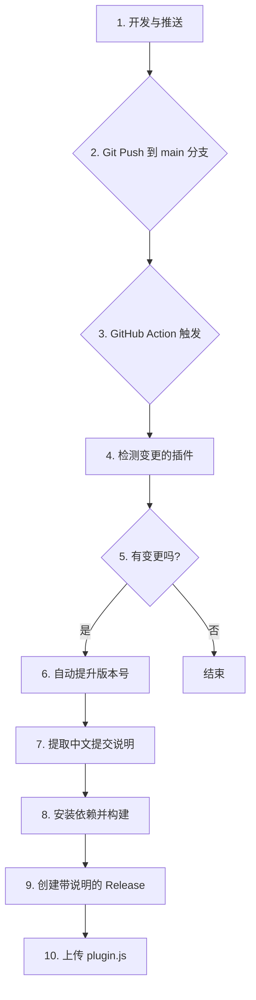

# Foxel Plus 插件开发规范

## 1. 概述

本文档为 `foxel-plus` 项目的插件开发提供了一套统一的规范和最佳实践。所有插件开发者都应遵循此规范，以确保插件的质量、一致性和可维护性。

## 2. Git 提交信息规范

为了实现发布说明的自动化生成，所有 Git 提交都必须遵循以下“约定式提交”格式。**提交信息必须使用中文**。

### 格式

```
<类型>(<范围>): <主题>

[正文]

[脚注]
```

*   **类型 (Type)**: 必须是以下之一：
    *   `feat`: 新功能
    *   `fix`: Bug 修复
    *   `docs`: 文档变更
    *   `style`: 代码风格（不影响代码运行的变动）
    *   `refactor`: 重构（既不是新增功能，也不是修改 bug 的代码变动）
    *   `perf`: 性能优化
    *   `test`: 增加测试
    *   `chore`: 构建过程或辅助工具的变动

*   **范围 (Scope)**: **必须**是本次提交影响的插件目录名。例如 `foxel-code-editor`。

*   **主题 (Subject)**: 简明扼要地描述本次提交的目的。

### 示例

```
feat(foxel-code-editor): 增加 Markdown 预览功能

在代码编辑器中为 Markdown 文件增加了实时预览模式。

- 支持标题、列表、代码块等基本语法
- 优化了渲染性能
```

```
fix(foxel-image-viewer): 修复了查看 SVG 文件时崩溃的问题
```

## 3. 插件生命周期

插件的生命周期由 Foxel 主程序管理，主要包含 `mount` 和 `unmount` 两个阶段。


## 4. 标准项目结构

每个插件都应作为一个独立的子目录存在，并包含以下标准文件结构：

```
foxel-my-plugin/
├── dist/
│   └── plugin.js         # (构建产物, .gitignore 中应忽略)
├── src/
│   ├── App.tsx           # 插件主 UI 组件
│   └── index.tsx         # 插件入口和注册逻辑
├── .gitignore
├── foxel.d.ts            # 官方类型定义 (请勿修改)
├── package.json          # 项目元数据和脚本
├── README.md             # 插件说明文档
├── tsconfig.json         # TypeScript 配置
└── validate-plugin.js    # 插件验证脚本
```

## 5. `package.json` 规范

`package.json` 文件是插件的身份标识，必须包含以下核心字段：

*   `name`: 插件名称，格式为 `foxel-<功能>-plus` (例如: `foxel-code-editor-plus`)。
*   `version`: 插件版本号，遵循 [SemVer](https://semver.org/) 规范。**此版本号将由自动化流程管理，请勿手动修改。**
*   `description`: 一句话描述插件的核心功能。
*   `author`: 开发者名称，请统一使用 "Jason"。
*   `main`: 构建产物的入口文件，必须指向 `dist/plugin.js`。

### 标准脚本

为了保持一致性，所有插件都应包含以下 `scripts`：

*   `build`: 生产环境构建。
*   `dev`: 开发环境构建，带 watch 功能。
*   `clean`: 清理 `dist` 目录。
*   `validate`: 运行插件验证脚本。

## 6. 插件定义 (`index.tsx`)

插件的入口文件 (`src/index.tsx`) 负责定义插件对象并调用 `window.FoxelRegister` 进行注册。

### `RegisteredPlugin` 接口字段详解

*   `key`: **极其重要**。插件的全局唯一标识符，必须遵循 `com.foxel-plus.<插件名>` 的格式。例如：`com.foxel-plus.code-editor-plus`。
*   `name`: 显示在插件市场的名称，应清晰易懂。
*   `version`: 必须与 `package.json` 中的版本号保持同步。**自动化流程会确保这一点。**
*   `author`: 必须与 `package.json` 中的作者保持同步。
*   `supportedExts`: 一个字符串数组，定义了此插件可以处理的文件扩展名。
*   `mount`: `(container: HTMLElement, ctx: PluginMountCtx) => void`。插件挂载函数。
*   `unmount`: `(container: HTMLElement) => void`。插件卸载函数。

## 7. UI 和样式

*   **技术栈**: 推荐使用 React + TypeScript。
*   **样式隔离**: 为避免污染 Foxel 全局样式，所有插件的根 DOM 元素都必须有一个**唯一 ID**，格式为 `foxel-<插件名>-plus`。所有 CSS 选择器都应基于这个 ID 进行限定。

## 8. 版本管理与发布流程 (自动化)

本项目的发布流程完全由 **GitHub Actions** 自动化，无需手动编译、打版或发布。

### 工作流程概述



### 开发步骤

1.  **本地开发**: 在本地完成插件的功能开发或修复。
2.  **本地验证**: (可选但推荐) 运行 `npm run validate` 和 `npm run build` 确保插件可以正常工作。
3.  **提交代码**: 按照 **Git 提交信息规范** 编写中文提交信息。
4.  **推送代码**: `git push origin main`。

### 自动化处理

*   **触发**: 当代码被推送到 `main` 分支时，自动化流程启动。
*   **版本**: 流程会自动检查本次推送中哪些插件目录有文件变动，并自动将其 `package.json` 中的 `patch` 版本号加 1。
*   **发布说明**: 流程会自动抓取从上个版本到当前版本之间、属于该插件的所有提交信息，并将其格式化为中文发布说明。
*   **构建与发布**: 流程会自动为每个版本变更的插件执行构建，并创建一个附带中文说明的 GitHub Release，同时将构建产物 `plugin.js` 上传为附件。

**重要**:
*   **不要在本地提交 `dist` 目录。** `.gitignore` 文件应包含 `dist/`。
*   **不要手动修改 `package.json` 中的 `version` 字段。**
*   **必须遵循 Git 提交信息规范**，否则发布说明将不准确。